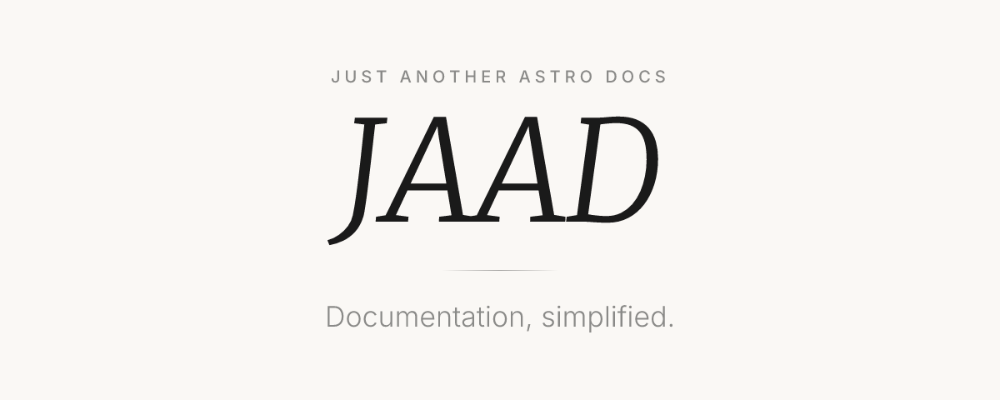

<p align="center">
  <a href="https://jaad.lancher.dev">
    
  </a>
</p>

<p align="center">
  An <a href="https://astro.build">Astro</a> integration that turns a folder of markdown into a documentation site.
</p>

<div align="center">

[](https://github.com/lancher-dev/jaad/actions/workflows/ci.yml)
[](https://github.com/withastro/astro/blob/main/LICENSE)
[](https://badge.fury.io/js/@lancher-dev%2Fjaad)
</div>

```bash
npm create @lancher-dev/jaad@latest my-docs
```

Or add it to a repository that already has a `docs/` folder:

```bash
npm create @lancher-dev/jaad@latest -- --here
```

By hand:

```bash
npm install @lancher-dev/jaad
```

```ts
// jaad.config.ts
import { defineJaadConfig } from "@lancher-dev/jaad";

export default defineJaadConfig({
  site: "https://example.dev",
  title: "My Project",
});
```

Documentation: [jaad.lancher.dev](https://jaad.lancher.dev)

## License

jaad is released under the [MIT License](/LICENSE).
